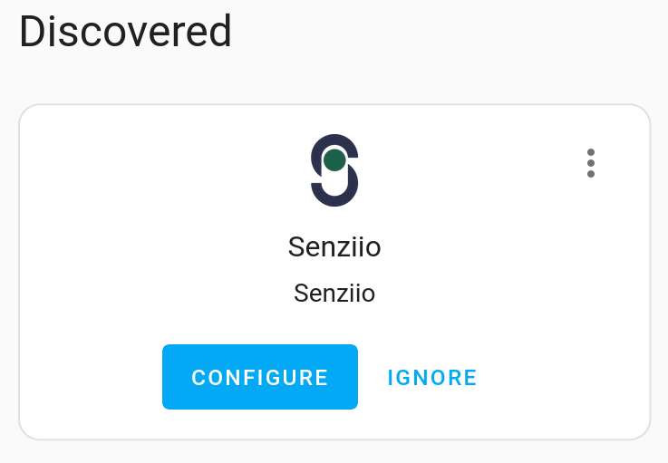
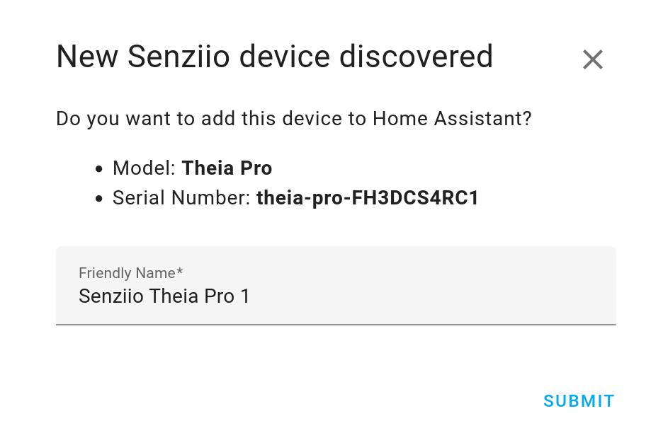
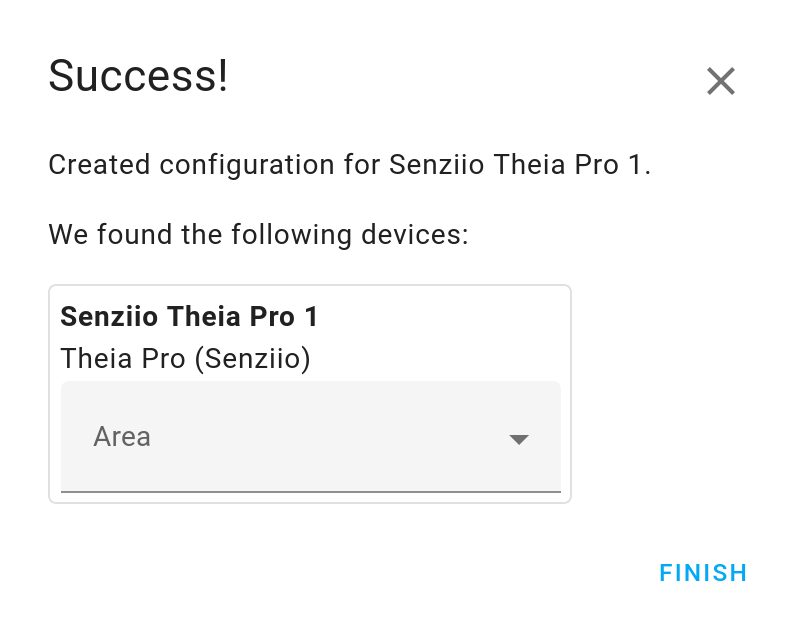
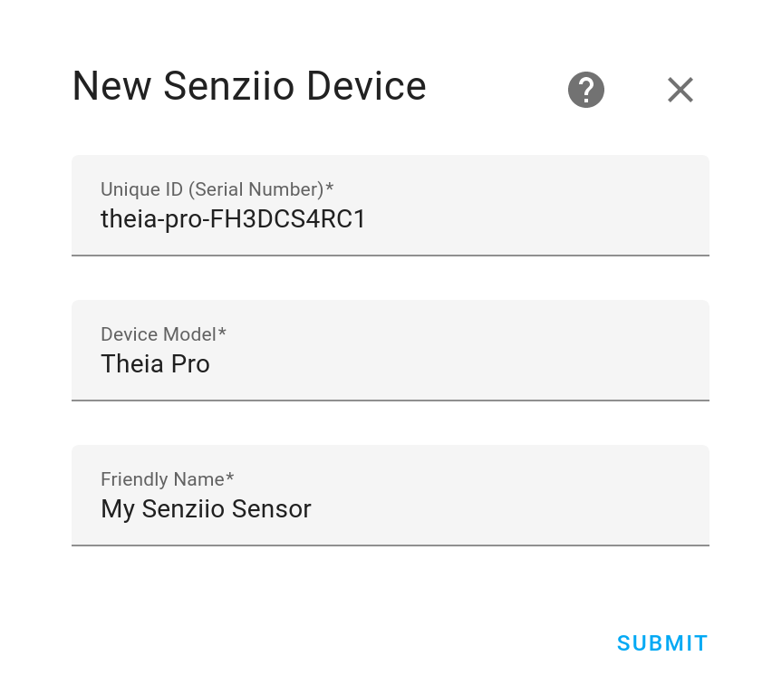
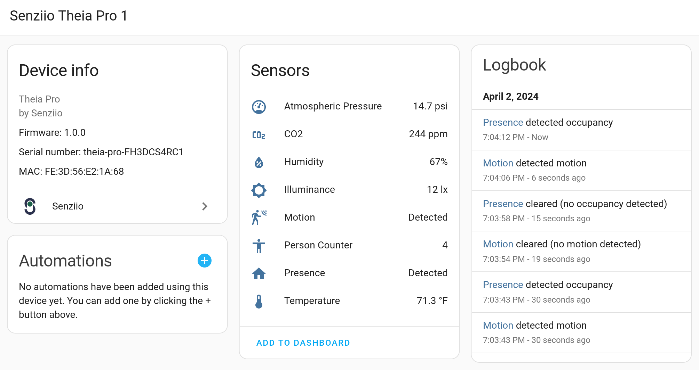

# Senziio Integration Documentation

The Senziio integration seamlessly brings [Senziio devices](https://senziio.com/)
into Home Assistant, enabling you to capture and utilize their wide range of
environmental data for smarter living.

## Requirements

To enable communication between Senziio devices and Home Assistant, the following
requirements must be met:

- **MQTT Integration**: The MQTT integration must be [enabled and configured](/integrations/mqtt/)
  in Home Assistant. You'll need to provide the MQTT broker information, which is where
  your devices will send their data.

- **Configure Senziio Devices**: Each of your Senziio devices must be configured to send data
  to the same MQTT broker. This involves setting the MQTT broker address, port, username,
  and password on each device. Refer to your Senziio device manual for specific instructions
  on how to do this.

### Setting up the MQTT broker

If you don't have an MQTT broker set up, [Mosquitto](https://mosquitto.org/) is a popular
open-source broker that can be used. Home Assistant also offers an
[MQTT broker as an add-on](https://www.home-assistant.io/addons/mosquitto/), which can be
easily integrated.

### Troubleshooting

- Ensure that the MQTT broker's address and port match exactly between the Home Assistant
  MQTT integration settings and your Senziio device settings.
- If using username and password authentication for the MQTT broker, verify that these
  credentials are correctly entered in both Home Assistant and your Senziio devices.

## Adding your Senziio device

Adding a Senziio device to Home Assistant can be done with ease, thanks
to the integration's support for both auto-discovery and manual setup.
Follow these steps to get started.

### Discovered devices

1. **Discover a device**: After turning on and configuring your Senziio device,
   an action card will show up for each new detected device in the discovered
   section of the integrations dashboard (Settings > Devices & Services > Integrations):

    

2. **Initiate the setup**: When starting the configuration, device information like
   model and serial number will be displayed. Here you can change the unique name
   assigned to the device, so you can easily identify it in your Home Assistant dashboard.

    

3. **Confirm the setup**: When confirming the setup, the connection with the device
   will be validated and a success message will show up. Here you have the option
   to assign the device to a specific area. This step can be done immediately or at
   a later time.

    

### Manual setup

If your device was not auto-discovered, or if you prefer to set it up manually,
you have the option to add it manually following these steps:

1. **Initiate the setup**: After powering on and configuring the device, go to the
   Settings > Devices & Integrations page, press the *Add Integration* button, and select the
   Senziio integration. Follow the prompts to input the model and the serial number provided
   with the device. This information is essential for Home Assistant to communicate
   correctly with your Senziio device. Here you can also change the default name assigned.

    

2. **Confirm the setup**. After confirmation, the connection with the device will
   be validated and an area can be assigned. The device should be ready for use now.

### Monitoring your Senziio device

After completing the setup, and once your device starts transmitting data, you will
see the entities populated with values in real-time, allowing you to monitor and
control your environment directly from Home Assistant:

## Sensors

Integrating Senziio devices with Home Assistant adds the following sensor entities,
enriching your smart home ecosystem with detailed environmental information:

- **Presence detector**: Detects human presence, enabling automation
  for lighting, security, and energy-saving scenarios.

- **Motion detector**: Identifies human movement, useful for security alerts,
  lighting control, and activity monitoring.

- **Person counter**: Counts the number of persons in an area, perfect
  for managing room occupancy and air quality control.

- **Temperature**: Measures ambient temperature, allowing for precise climate
  control to enhance comfort and save energy.

- **CO2**: Tracks carbon dioxide concentration, critical for ensuring
  healthy indoor air quality and ventilation.

- **Illuminance**: Measures light levels, supporting automation for lighting
  control, energy efficiency, and plant growth optimization.

Each sensor entity is designed for creating automations that adapt
your environment to your preferences, ensuring a healthier, comfortable,
efficient, and smarter living space.
